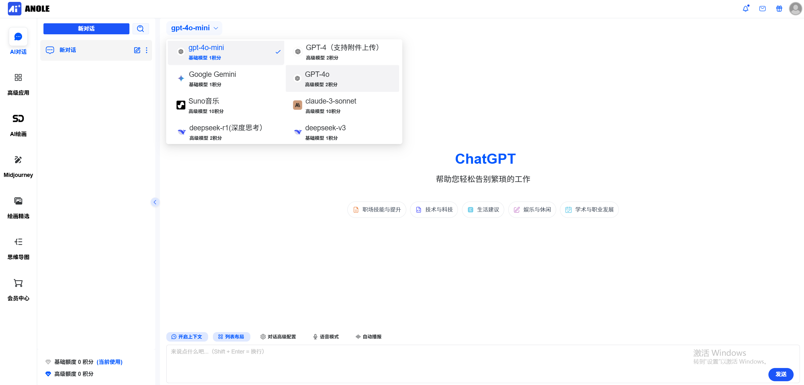

  
  
  # [Anole AICG](https://www.aicganole.com)

  #### 🚀【全栈式AI服务平台技术方案】🚀

  [网站](https://www.aicganole.com)  ·  [演示站](https://chat.aicganole.com)

  ——基于下一代弹性架构的智能商业生态——

  
  
  
  

## 核心架构
1. **高性能技术栈**
   - 基于NestJS服务端渲染架构，支持万级至千万级并发请求
   - 双模式部署方案：宝塔面板可视化部署/Docker容器化一键部署
   - 智能路由算法实现API调用自动负载均衡
   - 多终端自适应：PC/H5/微信公众号三端统一渲染引擎

2. **多模态模型中枢**
    - 支持主流AI服务接口：
      - OpenAI全系（含GPT-4o/o系列推理模型）
      - 国际平台：Azure/Claude/Gemini/Midjourney
      - 国产模型：DeepSeek/讯飞星火/通义千问/腾讯混元等
    - 动态模型扩展框架：
      - 新模型即插即用接入系统
      - 自定义模型分类与权重配置
      - 本地化部署支持（Ollama/LocalAI）

## 核心功能
3. **智能创作系统**
   - 超融合模型中枢：
      - 支持OpenAI全系列（含GPT-4o/最新o系列推理模型）
      - 覆盖全球主流AI服务（Azure/Claude/Gemini等12+平台）
      - 国产模型深度适配（DeepSeek/星火/通义/混元等8大国产引擎）
    - 专业绘画中心：
      - 支持Midjourney/DALL-E3/Stable Diffusion全功能操作
      - 进阶图像处理（换脸/风格迁移/混合制图）
   -  多模态交互：
      - 文/图/音/文档四维输入支持
      - 实时联网知识扩展

4. **商业运营系统**
    - 积分体系：
      - 三阶积分类型（基础/高阶/创作）
      - 自定义扣费策略与套餐组合
   -  支付系统：
      - 微信/易支付/国际支付通道
      - 自动化订单状态追踪

## 管理系统
5. **运维控制台**
   - 实时数据看板：
     * 用户增长/会话量/订单量三维统计
     * 流量趋势可视化分析
   - 内容安全中心：
     * 敏感词双引擎过滤（自定义+百度审核）
     * 操作日志审计追踪
   - 动态菜单管理：
     * 跨端界面定制（PC/移动独立配置）
     * 内嵌网页/外部链接混合编排

6. **用户体验优化**
    - 自适应交互框架：
      - 明暗主题自动切换
      - PWA渐进式Web应用支持
    - 低门槛访问：
      - 游客体验模式
      - 快速第三方登录（微信/手机/邮箱）
    - 创作辅助：
      - Markdown增强编辑器（代码/公式/图表）
      - 企业级文档解析（PDF/音视频/Office）

## 扩展体系
7. **生态扩展模块**
   - 插件市场架构：
     * 语音交互模块（Whisper/TTS）
     * GPTs应用商店
     * 智能体开发框架
   - API开放平台：
     * 第三方服务对接标准
     * 自定义功能扩展接口

> 系统采用模块化设计，各组件支持独立部署与自由组合，可根据业务需求灵活配置功能模块

## ❓ 常见问题 Q&A
1. **是否提供系统的演示或试用版?**
   - 是的，我们提供演示站，您可以注册并体验系统的部分功能。
2. **系统的兼容性加何?**
   - 我们的平台支持PC、移动端平板等设备, 和测究器(Chrome、FirefoxSafari等)兼容。
3. **用户需要准备什么内容吗？**
   - 因为平台需要用户自行管理，所以用户需提供以下内容（我们可协助用户进行准备）： 域名, 服务器, 短信服务,邮箱服务, 储存服务, 公众号-服务号, 支付模块, 百度统计账号。
4. **系统的兼容性加何?**
   - 我们的平台支持PC、移动端平板等设备, 和测究器(Chrome、FirefoxSafari等)兼容。
  
  

